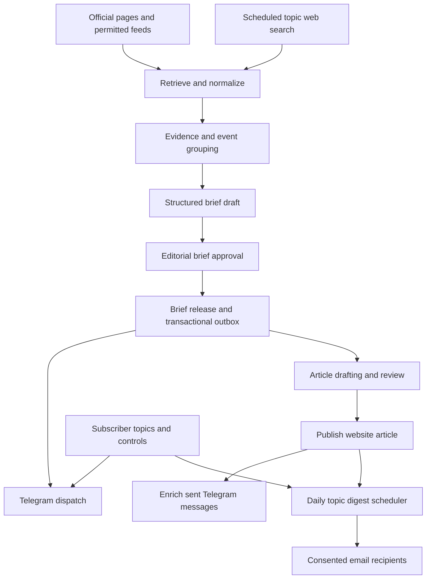

# Architecture

Status: proposed implementation, September 11, 2026. No providers are integrated. Product behavior is defined in [REQUIREMENTS.md](REQUIREMENTS.md).

## 1. Design approach

Use a modular application backed by PostgreSQL and durable background jobs. Keep the public reading path separate from research and generation. Store one canonical event with revisions, then render channel-specific content from approved facts.

The outbox releases Telegram first. Article work does not wait for every recipient to receive a message. Review and provider outages are visible states, not hidden success.

## 2. Proposed stack and selection gates

| Layer | Proposal | Selection rationale / condition |
| --- | --- | --- |
| Web and server endpoints | Next.js App Router + TypeScript | One public site and internal review interface; server-render published articles |
| Database | Supabase-managed PostgreSQL | Relational events, subscriptions, constraints, and optional similarity extension |
| Editor authentication | Supabase Auth | Server-verified identities and explicit editor roles; public reading remains anonymous |
| Background orchestration | Inngest | Scheduled and event-driven steps, bounded retries, concurrency control |
| Source ingestion | HTTP retrieval and RSS/Atom parsers | Start with permitted structured/simple pages; conditional requests and backoff |
| Web discovery | Trial Perplexity Search, Tavily, or Exa; choose one initially | Benchmark source coverage, freshness, extraction, restrictions, and cost |
| LLM | Hosted provider behind a structured-output adapter | Choose after evaluating factual support and actual token cost; no model is fixed |
| Similarity | Normalized URLs, hashes, entities, dates; optional pgvector | Avoid embeddings until lexical grouping limitations are observed |
| Telegram | Official Bot API | Direct subscriber alerts and message edits |
| Email | Resend candidate | Evaluate digest use, authentication, suppression, webhook support, and provider limits |
| Hosting | Managed Node-compatible hosting, chosen after worker experiment | Check job duration, outbound access, region, pricing, and crawling requirements |

Do not include a browser cluster, separate Python service, Redis, Kafka, external vector database, or CMS by default. If necessary sources require browser rendering, add one isolated bounded worker after measuring the need.

## 3. Module boundaries

Planned single-repository modules: source registry/retrieval, discovery, evidence, events, editorial, publishing, subscriptions, Telegram delivery, email digest, and operations. Each owns its domain behavior. Provider SDKs live behind adapters, not inside domain decisions.

Future application layout can use `src/app/` for pages/endpoints, `src/modules/` for domain code, `src/integrations/` for provider adapters, and `src/jobs/` for workflow entry points. This is a convention, not a request to scaffold now.

## 4. Research pipeline

### Source registry

Store canonical domain/URL, topics, source class, retrieval method, allowed use/retention notes, polling policy, parser configuration, freshness state, and owner. New sources are disabled until reviewed. Social links can be leads, but do not imply permission to scrape a platform.

### Discovery and retrieval

- Poll known sources using ETag/Last-Modified where available and a per-domain concurrency limit.
- Schedule broader queries by shared topic and event type. Use overlapping time windows to catch index delay; deduplication absorbs overlap.
- Parse content into clean text with headings, timestamps, source URL, and content hash. Record event date, source publication, modification, and first observation separately.
- Fetch underlying pages for verification. A search snippet alone should not support a detailed article.
- Do not infer publication time from retrieval time or an ambiguous search label.
- Honor access conditions, rate limits, and retention restrictions. Do not bypass paywalls or copy full articles into public outputs.

### Grouping and novelty

1. Normalize URLs without discarding parameters that identify distinct content.
2. Compare source/version hashes for unchanged documents.
3. Find candidate event matches by entities, event type, time, and title/text similarity.
4. Use model-assisted matching only on ambiguous candidates; preserve evidence and allow editor merge/split.
5. Assess substantive new facts versus a repeated report. Create an event revision for a real update.

### Generation and approval

Provide a bounded evidence bundle to the model and require structured fields with source IDs. Validate schema, source references, dates, and numbers; an LLM verification pass alone does not establish truth. The pilot editor approves the brief and later the article. Record model/prompt versions and cost metadata without logging sensitive inputs indiscriminately.

## 5. Data model

| Entity | Key fields and relationships |
| --- | --- |
| topics | Stable key, display name, description, active flag; exactly five active launch entries |
| sources | URL/domain, retrieval policy, access notes, health, last checked/succeeded |
| source_documents | Source ID, canonical URL, content hash, permitted extracted content, publication/retrieval times |
| events | Canonical ID, stable slug, event type, entities, first observed, primary topic, editorial state |
| event_topics | Many-to-many event/topic tags |
| event_revisions | Event ID, revision number, changed facts, evidence status, superseded revision |
| claims / claim_evidence | Claim text, source-document references, supporting excerpts, claim type and attribution |
| briefs / articles | Event revision, structured content, approval record, release/publication timestamps, version |
| subscribers | Internal ID, optional linked authentication identity, timezone, created/deleted state |
| topic_subscriptions | Subscriber/topic, activated/deactivated times; preserve history for digest eligibility |
| channel_subscriptions | Channel, private destination, consent and verification times, status, preferences |
| link_tokens | Hashed opaque token, purpose, expiry, consumed time, pending preference reference |
| delivery_outbox | Recipient/channel, event or digest ID, revision/purpose, idempotency key, availability time, state |
| delivery_attempts | Outbox ID, attempt, provider result/ID, retry time, error category; no raw secrets |
| digest_runs / digest_items | Subscriber, local date, UTC window, immutable item snapshot, status, sent references |
| editorial_actions | Actor, decision, affected event/version, reason, time |
| job_runs / usage_ledger | Job/source/provider identifiers, status, duration, usage, estimated cost |

Store instants in UTC and scheduling zones as IANA names. Use database constraints for unique canonical identities and delivery business keys. Exact schema and migrations follow the vertical slice.

## 6. State and transaction boundaries

Event workflow: `candidate → evidence_ready → brief_review → brief_approved → brief_released → article_review → published`. `held`, `rejected`, and revision/correction paths are explicit. Delivery status is independent of editorial state.

Delivery workflow: `pending → leased → provider_accepted`, with `retry_wait`, `failed`, `suppressed`, or `ambiguous` branches. Use `delivered` only when supported by a verified provider receipt. Telegram send success does not prove the user read or received a device notification.

Commit brief release and outbox intents atomically. A worker leases due intents, rechecks current subscription eligibility, and calls the provider. Use unique keys such as subscriber/channel/event/revision/purpose for alerts and subscriber/local-date for ordinary digests. Article-link edits use the existing Telegram message ID and a separate edit key.

Database deduplication does not create exactly-once external delivery. Telegram may accept a send before a worker crashes or times out. Mark that outcome ambiguous and require reconciliation or an explicit resend decision; do not blindly retry it and claim duplicate-free delivery. Use provider idempotency features when available and verified, with their actual retention window.

## 7. Telegram integration

- Use a private chat bot for topic-personalized delivery; not five group chats.
- Website creates a short-lived single-use start token for pending selections. It contains no personal data and cannot itself authorize takeover of an existing subscriber.
- Bot confirmation activates Telegram delivery; existing email identities are linked only after independent proof of email control and an explicit link confirmation. Never merge on a typed email alone.
- Verify webhook secret header, deduplicate update IDs, and keep bot token server-side.
- Queue fanout with conservative global and per-chat limits; honor provider `retry_after` responses. No paid broadcast mode by default.
- Store message ID after acceptance. Publish event triggers article-link edits; if the original is missing or uneditable, record failure and retain the website article without a second routine push.
- Recheck publication state when sending a delayed initial message so its article link is not lost in an edit/send race.
- Blocking the bot disables its delivery channel. Pause/stop actions invalidate pending sends. Quiet-hour accumulations become one compact catch-up message with source/article links as available.

## 8. Email digest integration

A periodic scheduler queries subscribers whose stored next cutoff is due; do not create one infrastructure cron definition per person. Compute local schedules with a timezone-aware library. Lock each digest run to avoid concurrent construction.

Select eligible published events using cutoff windows, topic membership at eligibility, and prior digest items. Store the item snapshot before sending. Use accessible HTML and a plain-text alternative. Configure domain authentication, unsubscribe headers/links, and provider event verification before real distribution.

Late articles become eligible after publication and carry their original story date. Do not advance the successful-delivery watermark on failure. Reconcile stale/ambiguous sends before a new day; intentionally coalesce remaining unsent items instead of sending several delayed editions. Unsubscribe and suppression are checked immediately before every attempt.

## 9. Security and privacy

- Server-side roles and database access policies protect subscriptions, evidence, drafts, and editor actions. Expose only approved public article fields.
- Separate subscriber delivery identity from editor authentication. Public subscription endpoints must not become database enumeration endpoints.
- Encrypt transport and use managed secret storage; restrict service-role database access to server workers.
- Bound URL fetching; reject private/reserved IP destinations after DNS resolution and on every redirect, restrict protocols, and cap bytes/time. Isolate browser rendering if introduced.
- Escape Telegram formatting and sanitize website/email markup. Never render raw scraped HTML or model-generated scripts.
- Keep page text as data. Generation has no access to delivery tools, subscription exports, credentials, or publishing approval.
- Use keyed hashes or internal IDs for diagnostics; exclude raw addresses, chat IDs, and magic links from logs.
- Define retention and deletion before launch. Deletion should stop pending sends, remove delivery identifiers, and retain only justified minimal suppression/audit data according to the adopted policy.

## 10. Operations and cost

Dashboard: source freshness, queue age, editorial wait, publish delay, delivery outcomes, suppression, and provider usage. Correlate logs by event, job, and opaque delivery ID. Distinguish source failure from an actual no-news period.

Proposed monthly cost model:

`hosting + database + scheduler + search calls + retrieval + LLM input/output + email + editorial labor`

For scale intuition, five topics with three queries each every 30 minutes generate 720 searches/day before retries. This is arithmetic, not a recommended production quota. Source polling and search retrieval are separate costs. Choose final intervals only after the pilot and budget decision.

Cache retrieved documents, filter unchanged content before generation, reuse approved event facts, bound retries and output tokens, and cap concurrent jobs. Stop or reduce noncritical discovery when approaching the budget; never generate unsupported content to fill gaps.

Use local fixtures, a staging database, separate provider credentials, and an explicit sandbox recipient allowlist. Preview environments cannot send to production recipients. Back up the database and test restoration before public launch. Define an incident owner and channel-specific pause switches.

## 11. Alternatives and unresolved choices

- Search provider: compare Perplexity Search, Tavily, and Exa with the same source/event sample. Select one; do not pay for all three by default.
- Polling tool: custom lightweight retrieval versus changedetection.io; choose based on source complexity and operational cost.
- Queue: Inngest is proposed; use a database outbox regardless so editorial transactions remain durable.
- Email: validate Resend suitability, suppression behavior, and pricing against the expected audience before committing.
- Hosting: choose after the ingestion experiment establishes process duration and browser requirements.
- Model: evaluate schema reliability, factual support, latency, and cost; do not hardcode a model name from illustrative conversation examples.

## 12. Reference documentation

Capabilities checked September 11, 2026; verify current limits, terms, and pricing during integration. These references describe available tools, not guaranteed suitability or an executed benchmark.

- [Next.js App Router](https://nextjs.org/docs/app)
- [Supabase Auth](https://supabase.com/docs/guides/auth) and [pgvector](https://supabase.com/docs/guides/database/extensions/pgvector)
- [Inngest scheduled functions](https://www.inngest.com/docs/guides/scheduled-functions)
- [Telegram Bot API](https://core.telegram.org/bots/api), [deep linking](https://core.telegram.org/bots/features#deep-linking), and [bot limits](https://core.telegram.org/bots/faq)
- [Resend batch email](https://resend.com/docs/dashboard/emails/batch-sending)
- [Gmail sender guidelines](https://support.google.com/a/answer/81126)
- [Perplexity Search](https://docs.perplexity.ai/docs/search/quickstart), [Tavily Search](https://docs.tavily.com/documentation/api-reference/endpoint/search), and [Exa content freshness](https://exa.ai/docs/reference/livecrawling-contents)
- [changedetection.io](https://github.com/dgtlmoon/changedetection.io)
